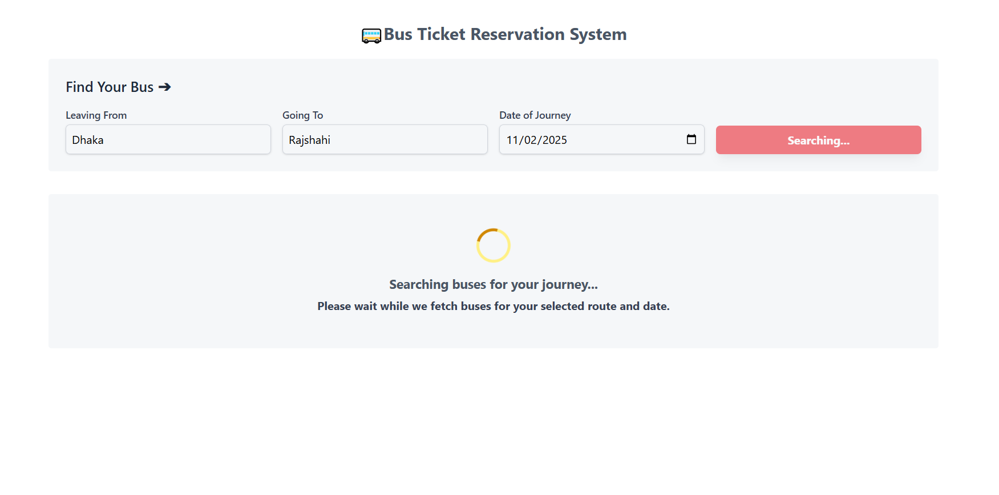
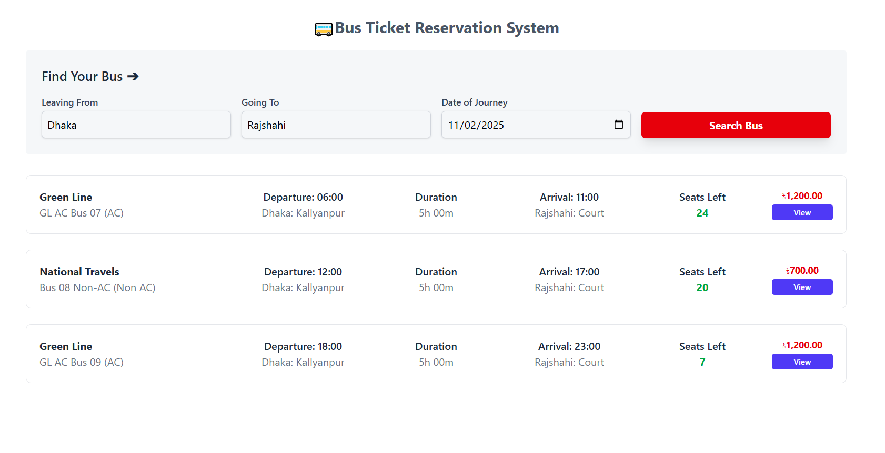
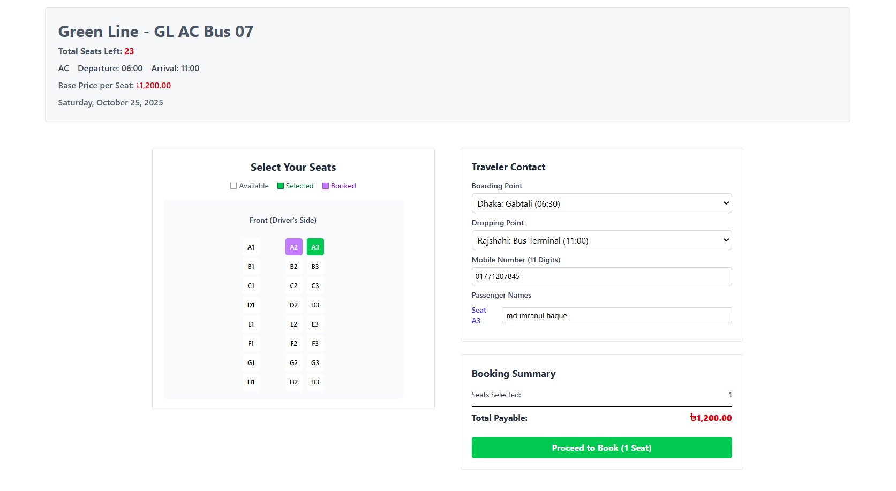
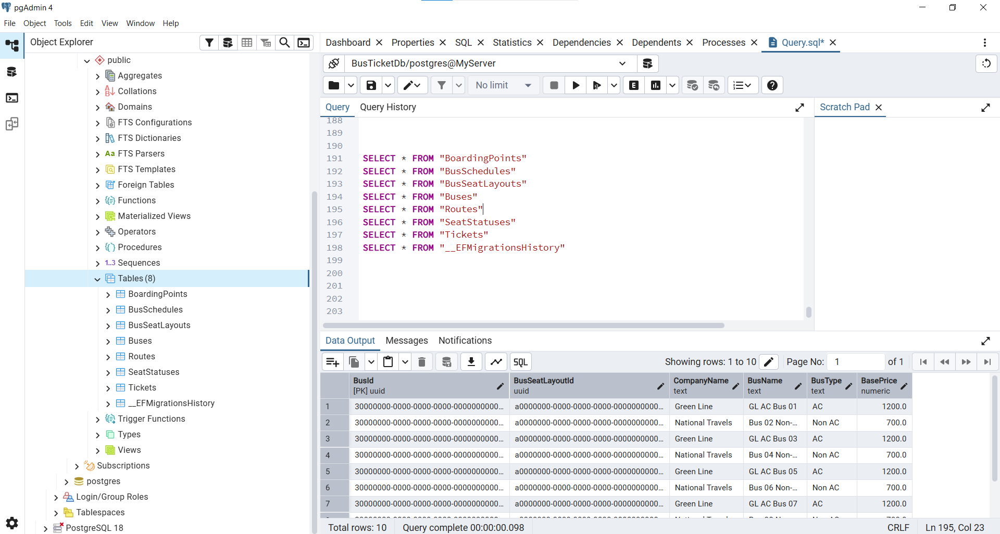

### 🚌 Bus Ticket Reservation System

[](https://dotnet.microsoft.com/)
[](https://angular.io/)
[](https://en.wikipedia.org/wiki/Domain-driven_design)

This project is a **Bus Ticket Reservation System** developed as an assignment for the Full-stack (.NET) Developer Internship Batch 3. It is designed from the ground up to be scalable, maintainable, and reliable, strictly adhering to **Clean Architecture** and **Domain-Driven Design (DDD)** principles.

---

### Table of Contents

1. [Key Functional Features](#key-functional-features)
2. [Technology & Architecture](#technology--architecture)
3. [Architecture Overview (Clean Architecture + DDD)](#architecture-overview-clean-architecture--ddd)
4. [Setup and Running the Application](#setup-and-running-the-application)
   * [Prerequisites](#prerequisites)
   * [Backend Setup](#backend-setup)
   * [Frontend Setup](#frontend-setup)
   * [Testing](#testing)
5. [UI Visualization](#ui-visualization)
6. [Database Visualization](#database-visualization)
6. [Project Status & Next Steps](#project-status--next-steps)
7. [Author & Contact](#author--contact)


---

### Key Functional Features

The system implements the following core functionalities:

**A. Search Available Buses**

* Users can search by **Going From, Going To, and Journey Date.**
* Results display **Company Name, Bus Name, Start/Arrival Time, Price, and dynamically calculated Seats Left.**

**B. View Seat Plan & Book Seats**

* Selecting a bus displays a seat layout.
* Seats are visually represented by status: **Available, Selected, and Booked.**
* Users can select a **Boarding Point,** **Dropping Point**, **enter Name**, and **Mobile Number.**
* **Transaction:** Booking logic (`BookSeatAsync`) is executed within a database transaction to ensure **atomicity**, updating the seat status and creating a `Ticket` entity, thus preventing double-booking issues.

---

### Technology & Architecture

| Component | Technology | Version / Requirement | Notes |
| :--- | :--- | :--- | :--- |
| **Backend** | .NET Core (C#) | .NET 9 | RESTful API |
| **Database** | Entity Framework Core | PostgreSQL | Data persistence |
| **Frontend** | Angular + TypeScript | Angular v20 | User Interface (ClientApp) |
| **Styling** | Tailwind CSS | v4 | Frontend styling |
| **Testing** | xUnit | v2.9.2 | Unit Testing, Logic and validation testing |

---

### Architecture Overview (Clean Architecture + DDD)

The solution is divided into distinct layers to enforce Separation of Concerns, manage dependencies, and facilitate testing.

| Layer (Project) | Responsibility | Key Contents | DDD Focus |
| :--- | :--- | :--- | :--- |
| **Domain** | Core business rules and entities | Entities, Value Objects, Domain Services | Domain Model |
| **Application** | Business logic, use cases | Application Services (e.g., `SearchService`, `BookingService`), Use Cases | Orchestration |
| **Application.Contracts** | Data Transfer Objects, Interfaces | DTOs (`AvailableBusDto`, `SeatPlanDto`), Interfaces | Contracts for communication |
| **Infrastructure** | Data access and external dependencies | EF Core `DbContext`, Repository Implementations | Persistence |
| **WebApi** | API controllers and endpoints | REST API controllers, Dependency Injection setup | Presentation |
| **ClientApp** | User Interface | Angular application | Presentation |
| **Tests** | Unit and integration testing | xUnit test projects, Mocking, Validation of business logic | Quality Assurance |

---

### Setup and Running the Application

#### Prerequisites

* [.NET 9 SDK](https://dotnet.microsoft.com/download/dotnet/9.0)
* [Node.js (Includes npm)](https://nodejs.org/en/download/)
* [PostgreSQL Database Server](https://www.postgresql.org/download/)

### Backend Setup

#### At first, should clone this repo.

```bash
git clone https://github.com/Imran-2022/BT-System.git
cd BT-System
```
### then →
Configure the Database, 
Open the `appsettings.json` file in the `/src/WebApi` project and update the connection string to point to your PostgreSQL instance.

#### Example:
   ```json
   "ConnectionStrings": {
     "DefaultConnection": "Host=localhost;Port=5432;Database=BusBookingDb;Username=postgres;Password=yourpassword"
   }
```

### then follow this steps →

Apply database migrations (creates DB if missing) [from root means when you in BT-System]
```
dotnet ef database update --project src/Infrastructure --startup-project src/WebApi
```
 
Navigate to WebApi folder
```bash
cd src/WebApi
```

(Optional) Restore dependencies
```
dotnet restore
```

Run the backend API
```
dotnet run
```

### Frontend Setup

Navigate to the Angular project folder and install required packages:

```bash
cd src/ClientApp
npm install

```
Configure API URL

Open the `api.ts` file in the `src/ClientApp/src/app/core/`project and Update this to match your backend URL and port
```
/** Base URL of the .NET API */
  private readonly baseUrl = 'http://localhost:5106/api'; 
```
Run the Frontend 
```
npm start 
or
ng serve
```
by this, The frontend should be accessible at localhost:4200 (or the port indicated by Angular CLI).

### Testing

From the root of the solution, execute:

```bash
dotnet test src/BusTicketReservationSystem.sln
```

####  UI Visualization 

#### @ Search loading
<p align="center">
  <kbd>
    
  </kbd>
</p>

#### @ Search result
<p align="center">
  <kbd>
    
  </kbd>
</p>

#### @ Selected Bus seat layout
<p align="center">
  <kbd>
    
  </kbd>
</p>

### Database Visualization

#### @ PG-Admin 
<p align="center">
  <kbd>
    
  </kbd>
</p>

### Project Status & Next Steps

**Core Features Implemented:**
- Search for available buses
- View seat plan
- Book seats with transaction safety
- Backend & frontend fully connected
- Unit tests with xUnit

**Planned / Next Steps:**
- User registration system
- Payment integration
- Admin dashboard for bus and schedule management
- Enhanced frontend styling and responsiveness
- Additional integration and E2E tests
- PDF version of ticket after purchase

### Author & Contact 
**Author :** Md Imranul Haque  
**Email :** mdimranulhaque.hstu@gmail.com  
**LinkedIn :** [https://www.linkedin.com/in/md-imranul-haque/](https://www.linkedin.com/in/md-imranul-haque/)

Feel free to reach out for collaboration, feedback, or questions about this project.